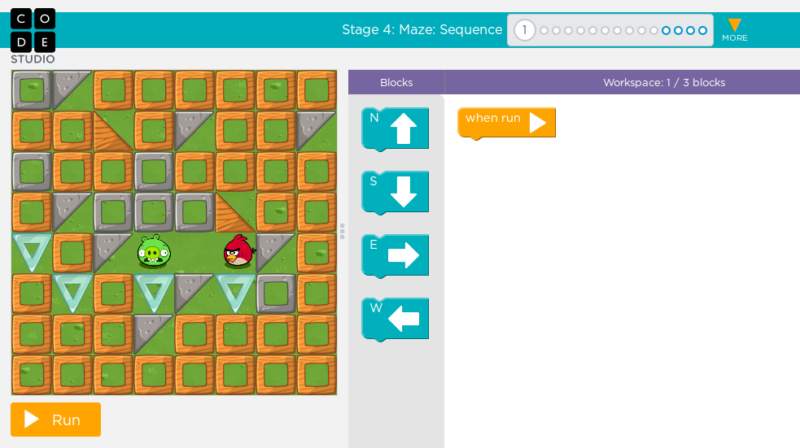
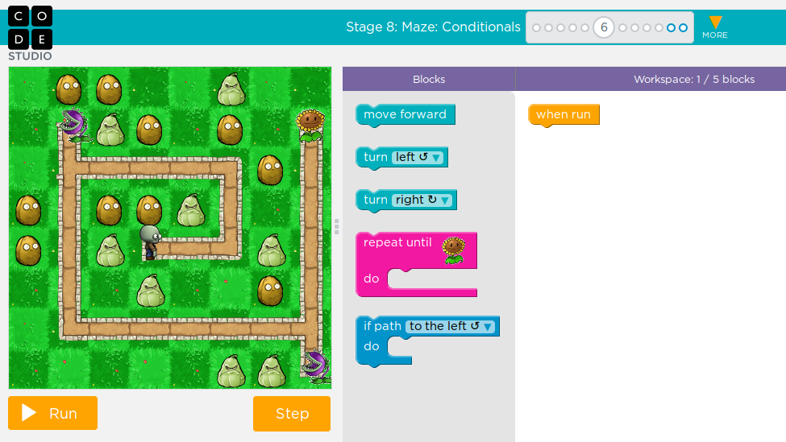
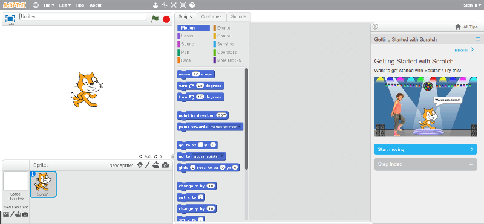
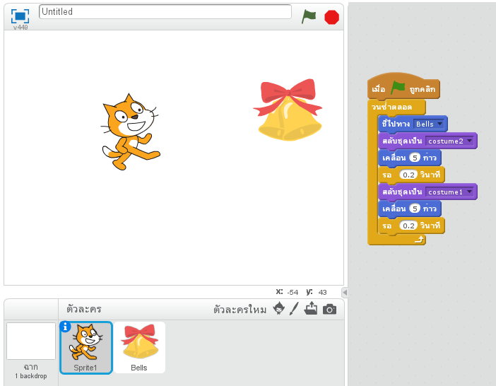

# แหล่งเรียนรู้เกี่ยวกับการเขียนโปรแกรมสำหรับเด็กและผู้เริ่มต้น

ทักษะการเขียนโปรแกรมเป็นสิ่งที่มีความสำคัญมากขึ้นเรื่อย ๆ ด้วยทรัพยากรที่มีมากมายบนอินเทอร์เน็ต
การเริ่มต้นจึงไม่ใช่เรื่องที่ยากจนเกินไปอีกแล้ว อย่างไรก็ตาม เอกสารชิ้นนี้พยายามรวมรวมเว็บไซต์ต่าง ๆ
พร้อมทั้งรายละเอียดคร่าว ๆ เพื่อให้ผู้สนใจสามารถเริ่มต้นได้อย่างรวดเร็ว และเลือกเล่นได้อย่างเหมาะสม

การใช้เครื่องมือเหล่านี้แม้จะทำให้การหัดเขียนโปรแกรมง่ายขึ้น แต่ไม่สามารถทำให้การเขียนโปรแกรมกลายเป็นเรื่องง่ายไปได้ ผู้เริ่มต้นอาจจะต้องการกำลังใจและการสนับสนุนเป็นพิเศษในการเริ่มต้นฝึกทักษะใหม่ที่จะมีคุณค่าต่อไปในอนาคต

## กลุ่มที่โปรแกรมด้วยการต่อบล็อค

### 1. [Code Studio](https://studio.code.org/) บน [Code.org](http://code.org)

* ลิงก์: [https://studio.code.org/](https://studio.code.org/)
* Platform: เว็บ สามารถเล่นบนมือถือได้ (แต่รูปบล็อคจะมีขนาดเล็ก)
* ลักษณะเด่น: บทเรียนออกแบบดีมาก ตัวละครประกอบโจทย์เป็นที่รู้จัก (เช่น ตัวละครจาก angry birds, zombie, หรือ star wars)
* ลักษณะการสอน: เล่นเกมแก้โจทย์ปัญหา มีคำแนะนำด้วยวิดีโอ
* ลักษณะโปรแกรม: เขียนด้วยการลากวางบล็อค
* ระดับความยาก-ง่าย: ตั้งแต่เริ่มต้น
  * มี 4 ระดับแยกตามอายุ แต่ละระดับมีโจทย์จำนวนพอสมควร
  * มีส่วนคอร์สเร่งรัด (accelerated course) และมีส่วนบทเรียนที่ไม่ใช้คอมพิวเตอร์ (unplugged lessons)
* การรองรับภาษาไทย: วิดีโอมีคำบรรยายภาษาไทย
* เนื้อหาที่สอน: การโปรแกรมลำดับ ตัวแปร การทำซ้ำ โปรแกรมย่อย
* ประเด็นที่ควรระวัง:
  * เว็บไซต์ออกแบบให้เป็นเกมการแก้ปัญหาที่ดีและน่าสนใจ แต่เนื่องจากรูปแบบเป็นการแก้โจทย์ที่ออกแบบมาแล้ว การใช้งานเว็บนี้จึงขาดส่วนของการฝึกให้ผู้เรียนได้สร้างสรรค์ผลงานด้วยตนเอง ซึ่งระบบเช่น Scratch อาจจะทำได้ดีกว่า
* รายละเอียดอื่น ๆ
  * เมื่อส่งโปรแกรมแบบบล็อคเสร็จ สามารถกดดูโปรแกรมที่เทียบเท่ากันในภาษา JavaScript ได้

#### รูปตัวอย่างหน้าจอการเรียน
* ตัวอย่างโจทย์ง่าย บทเรียนที่ 1 สำหรับเด็ก 4-6 ปี   
* ตัวอย่างโจทย์เด็กโต บทเรียนที่ 3 สำหรับเด็ก 8-18 ปี  

#### กิจกรรม an hour of code บน [Code.org](https://code.org/learn)
* กิจกรรม [Hour of Code](https://en.wikipedia.org/wiki/Code.org#Hour_of_Code) เป็นกิจกรรมที่พยายามให้คนที่สนใจได้ทดลองเขียนโค้ดที่เริ่มจัดขึ้นในช่วงสัปดาห์การศึกษาด้าน computer science
* ลักษณะเด่น: เป็นการรวบรวมบทเรียนสั้น ๆ (ทำจบในเวลาไม่นาน) หลายบทเรียนมีการดำเนินเรื่องด้วยตัวละครที่เป็นที่รู้จัก บทเรียนย่อยมีดังนี้
  * [Starwars: Building a Galaxy With Code](https://code.org/starwars) - นอกจากใช้บล็อคแล้วยังใช้ JavaScript ได้ด้วย
  * [Minecraft Hour of Code](https://code.org/mc)
  * [Code with Anna and Elsa](https://hourofcode.com/frzn)
  * [Classic Maze](https://hourofcode.com/code) - เรียนกับ Mark Zuckerberg และ Angry Birds
  * [Make a Flappy game](https://hourofcode.com/flap)
  * [Infinity Play Lab](https://hourofcode.com/inf)
  * [Play Lab](https://hourofcode.com/lab)
  * [Artist](https://hourofcode.com/art)

### 2. [Scratch](https://scratch.mit.edu/) และ [ScratchJr](https://www.scratchjr.org/)

* ลิงก์:
  * Scratch: [https://scratch.mit.edu/](https://scratch.mit.edu/)
  * ScratchJr: [http://www.scratchjr.org/](http://www.scratchjr.org/)
* Platform: Scratch เป็นระบบบนเว็บ (ใช้ Flash)  ส่วน ScratchJr เป็นระบบบนแทบเล็ต
* ลักษณะเด่น:
  * มีการแปลคำสั่งแบบบล็อคเป็นภาษาไทย
  * เขียนโปรแกรมควบคุมตัวละครให้ทำงานต่าง ๆ รวมทั้งสามารถเปลี่ยนรูปร่างตัวละครให้เป็นภาพเคลื่อนไหวได้ง่าย
  * สามารถประยุกต์ได้หลากหลาย และในเว็บ [Scratch](https://scratch.mit.edu/) มีโครงงานต่าง ๆ ที่แชร์ไว้จำนวนมาก สามารถโหลดไปศึกษาและแก้ไขได้
* ลักษณะโปรแกรม: เขียนด้วยการลากวางบล็อค
* ลักษณะการสอน: มีคำแนะนำการเขียนโปรแกรมเริ่มต้นอยู่บนหน้าจอ

#### รูปตัวอย่างหน้าจอการเรียน
* ตัวอย่างหน้าจอหลักของ Scratch ในจอแสดงตัวละครหนึ่งตัว คำแนะนำการหัดเขียนจะอยู่คอลัมน์ด้านขวามือ   
* ตัวอย่างโปรแกรมเขียนให้แมวค่อย ๆ เดินไปหากระดิ่ง พร้อม ๆ กับเปลี่ยนรูปร่างไปมาให้ดูคล้ายภาพเคลื่อนไหว สังเกตว่าคำสั่งในบล็อคเป็นภาษาไทย   

### 3. [Snap!](http://snap.berkeley.edu/)

### 4. [Alice](http://www.alice.org/index.php)

## กลุ่มที่ใช้ภาษาโปรแกรม

### 1. [Greenfoot](http://www.greenfoot.org/)

### 2. [Code Combat](https://codecombat.com/)

### 3. [KidsRuby](http://kidsruby.com/)

## เว็บสอนเขียนโปรแกรมอื่น ๆ (อาจจะไม่ได้เน้นเฉพาะเด็ก)

### 1. [Codecademy](https://www.codecademy.com/)

## เอกสารเพิ่มเติม

* [บทความ Programming for Children, Minus Cryptic Syntax](http://www.nytimes.com/2011/11/10/technology/personaltech/computer-programming-for-children-minus-cryptic-syntax.html?_r=4) พูดถึงการเขียนโปรแกรมสำหรับเด็ก ด้วยเครื่องมือที่ลดปัญหาเรื่องไวยากรณ์ บทความกล่าวถึง Scratch, Alice, Codecademy, [Dontfeartheinternet](http://dontfeartheinternet.com/), KidsRuby, [JustBasic](http://justbasic.com/), [Corona](https://coronalabs.com/)
